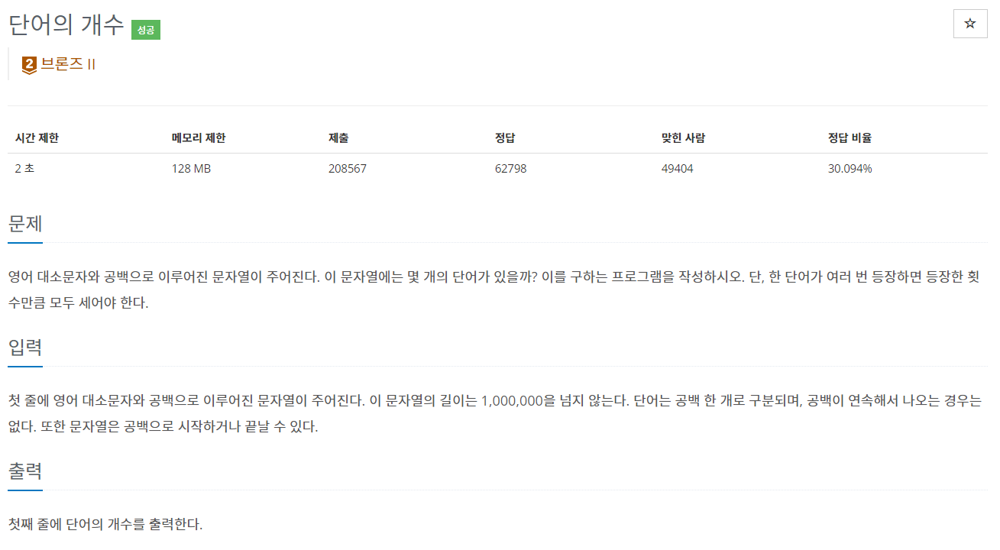

## [C / C++] 백준 1152번 - 단어의 개수

#### 백준 1152번

#### 문제 설명

문제 제목 그대로 영어 대소문자와 공백으로 이루어진 **문자열에 포함된 단어의 개수**를 찾으면 된다. 

한 단어가 여러 번 등장하면 등장한 횟수만큼 모두 세어야 한다.

#### 알고리즘 설명

이 문제의 경우 공백의 조건이 총 3가지이다.

1. 문자열의 시작이 공백일 수 있다.

2. 문자열의 끝이 공백일 수 있다.

3. 공백은 연속해서 나올 수가 없다.

따라서 이 공식을 이해하게 되면 **문장의 맨 첫 번째와 마지막을 제외한 공백의 개수 +1 만큼 단어가 있다**는 것이다.

예제 2를 보면,

"_The_first_character_is_a_blank"

맨 첫 번째 공백을 제외하고 총 5개의 공백을 갖고 있다.

각 공백은 무조건 자신의 왼쪽에 있는 단어 한 개와 짝을 이루고 있고, 

항상 마지막 단어는 혼자 존재한다.

​    

따라서 맨 첫 번째와 마지막을 제외한 공백의 개수 + 1 

<u>=> 문자열에서의 단어의 총 개수</u>이다.

### 코드 

\* tip 1 : scanf("%[^\n]", word);

원래 scanf의 경우 공백을 입력할 수 없는데, 위와 같이 쓰면 엔터 입력 전까지 공백을 포함한 모든 문자열을 입력할 수 있다.

\* tip 2 : strlen(word)

입력하는 문자열의 길이가 각각 다르기 때문에 strlen()을 사용하면 입력하는 문자열에 맞춰 반복문을 설정할 수 있다.
