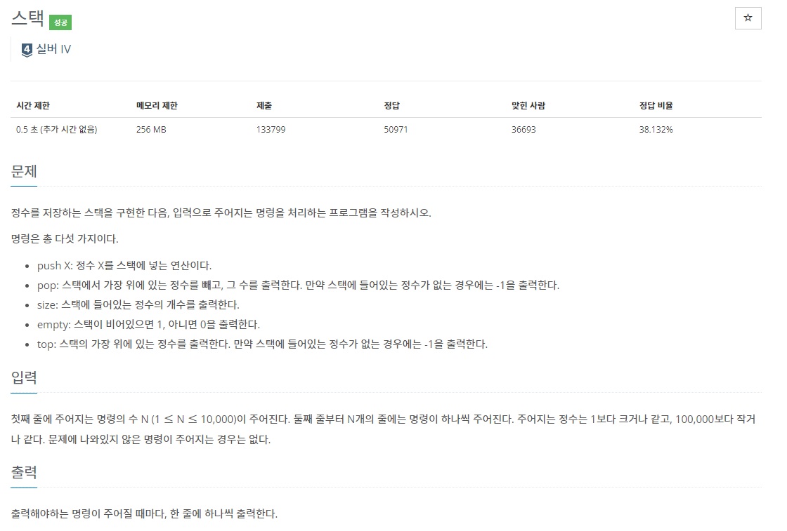

## [C / C++] 백준 10828 - 스택(Stack)

#### 백준10828번 - 스택(Stack)

#### 문제 설명

말그대로 스택을 구현하는 문제이다.

**스택이란?**

간단하게 설명하자면 <u>입구와 출구가 같은 구조</u>라고 볼 수 있다. 

LIFO (Last In First Out) 구조로, 마지막에 넣은 것을 가장 첫 번째로 꺼낸다는 것을 의미한다. 

​    

넣는 것은 ‘push’, 빼는 것은 ‘pop’이라고 칭하는데, 

접시를 쌓으면 맨 위에 놓인(맨 마지막에 놓은) 접시부터 빼는 것처럼 가장 나중에 넣은 정보를 먼저 꺼내는 구조이다.

​    

예를 들어 a -> b -> c 순서대로 넣었다면, 뺄 때는 c -> b -> a 순서로 꺼내게 된다는 것이다.

​    

1. 초기 상태 (아무것도 없는 공백 상태)

|      |
| ---- |
|      |
|      |

2. push(a) -> push(b) -> push(c)

|      |      | c    |
| ---- | ---- | ---- |
|      | b    | b    |
| a    | a    | a    |

3. pop() -> pop() -> pop()

|      |      |      |
| ---- | ---- | ---- |
| b    |      |      |
| a    | a    |      |

1.  push X : 정수 X를 스택에 넣는다.

2. pop : 스택에서 가장 위에 있는 정수(맨 마지막에 넣은 정수)를 빼고, 그 수를 출력

​                 (만약 비어있으면 –1 출력)

3. size : 스택에 들어있는 정수의 개수 출력

4. empty : 스택이 비어있으면 1, 아니면 0 출력

5. top : 스택 가장 위에 있는 정수 출력, 비어있으면 –1 출력

  

#### 알고리즘 설명

1. 전역변수 idx를 사용

* 인덱스는 0부터 시작하기 때문에 0이 아니라 –1이 비어있는 상태임

* 따라서 초기상태는 –1로 시작하도록 설정

​    

2. top()

* idx가 –1이면 공백이므로 –1 반환

* 아니면 stack[idx] (맨 위에 있는 값) 반환

​    

3. push(int x)

* idx가 –1부터 시작했기 때문에 먼저 idx++을 하여 0으로 만들고,

* stack[idx]에 x 저장

​    

4. pop()

* idx가 –1이면 공백이므로 –1 반환

* pop()을 하면 맨 위 정수 하나를 없애는 것이므로 idx--

* 없애기 전 정수를 반환해야 하므로 stack[idx+1] 반환

​    

5. size()

* idx는 –1부터 시작하기 때문에 +1한 값이 현재 스택에 들어있는 정수의 개수

​    

6. empty()

* idx == -1 공백 / idx > -1 공백 X

### 코드 [직접 구현]

위 코드는 stack의 정확한 알고리즘을 공부하기 위해서 풀어서 구현해보았다. 만약 C++을 통해 쉽게 구현하고 싶다면 이미 stack을 구현해놓은 C++의 내장함수를 사용하면 된다.

### 코드 [C++ 내장함수]

