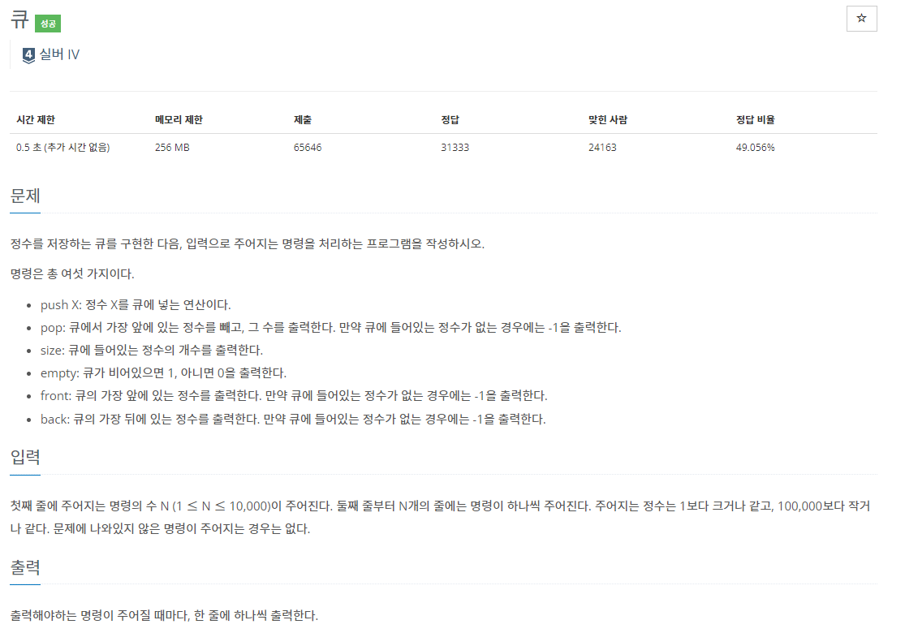

## [C / C++] 백준 10845 - 큐(Queue)

#### 백준10845번 - 큐(Queue)

#### 문제 설명

말 그대로 큐를 구현하는 문제이다.

​    

**큐란?**

간단하게 설명하자면 선입선출 구조라고 볼 수 있다.

**FIFO (First In First Out) 구조**로, 먼저 넣은 자료를 먼저 꺼낸다는 것을 의미한다. 

​    

넣는 것은 ‘push’, 빼는 것은 ‘pop’이라고 칭하는데, 

식당에 가서 줄을 서면 먼저 줄을 선 사람부터 차례로 입장하듯이 가장 먼저 넣은 정보부터 차례로 꺼내는 구조이다.

​    

예를 들어 a -> b -> c 순서대로 넣었다면, 뺄 때는 a -> b -> c 순서로 꺼내게 된다는 것이다.

1. 초기 상태 (아무것도 없는 공백 상태)

|      |      |      |
| ---- | ---- | ---- |

2. push(a) -> push(b) -> push(c)

| a    |      |      |
| ---- | ---- | ---- |

| a    | b    |      |
| ---- | ---- | ---- |

| a    | b    | c    |
| ---- | ---- | ---- |

3. pop() -> pop() -> pop()

|      | b    | c    |
| ---- | ---- | ---- |

|      |      | c    |
| ---- | ---- | ---- |

|      |      |      |
| ---- | ---- | ---- |

1. push X : 정수 X를 큐에 넣는다.

2. pop : 큐에서 가장 앞에 있는 정수를 빼서 출력

​      (비어있다면 –1 출력)

3. size : 큐에 들어있는 정수의 개수 출력

4. empty : 큐가 비어있으면 1, 아니면 0 출력

5. front : 큐의 가장 앞에 있는(먼저 넣은) 정수 출력, 비어있으면 –1출력

6. back : 큐의 가장 뒤에 있는(마지막에 넣은) 정수 출력, 비어있으면 –1 출력

#### 알고리즘 설명

1. 전역변수 idx_f, idx_b을 사용

* idx_b은 현재 큐의 마지막 인덱스를 뜻하며, idx_f는 맨 앞 인덱스를 뜻함

* 인덱스는 0부터 시작하기 때문에 idx_b을 0이 아니라 –1로 시작함

​    

2. front()

* empty() == 1이면 –1 반환

* 아니면 queue[idx_f] (맨 앞에 있는 값) 반환

​    

3. back()

* empty() == 1이면 –1 반환

* 아니면 queue[idx_b] (맨 뒤에 있는 값) 반환

​    

4. push(int x)

* idx_b가 -1부터 시작했기 때문에 +1을 한 후 값 x 넣기

​    

5. pop()

* empty() == 1이면 공백이므로 –1 반환

* pop()을 하면 맨 앞 정수를 꺼내기 때문에 idx_f++

* 꺼내기 전 정수를 반환해야 하므로 queue[idx_f-1] 반환

​    

6. size()

* (마지막 인덱스 - 첫 번째 인덱스) + 1을 하면 전체의 개수가 나옴

​    ex) idx_f == 1 / idx_b == 3

| idx = 0 | idx = 1 | idx = 2 | idx = 3 |
| ------- | ------- | ------- | ------- |
|         | a       | b       | c       |

(idx_b – idx_f = 3-1 = 2) -> 2+1 = 3

​    

7. empty()

* idx_f > idx_b이면 비어있다고 판단함

  

### 코드 [직접 구현]

위 코드는 queue의 정확한 알고리즘을 공부하기 위해서 풀어서 구현해보았다. 만약 C++을 통해 쉽게 구현하고 싶다면 이미 queue를 구현해놓은 C++의 내장함수를 사용하면 된다.

### 코드 [C++ 내장함수]

