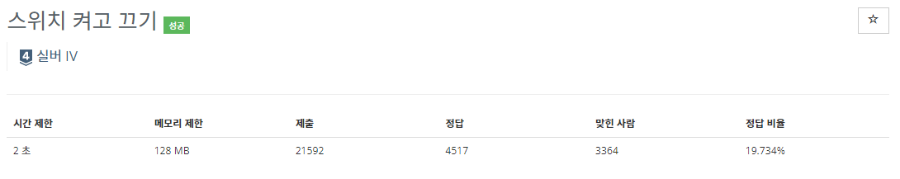
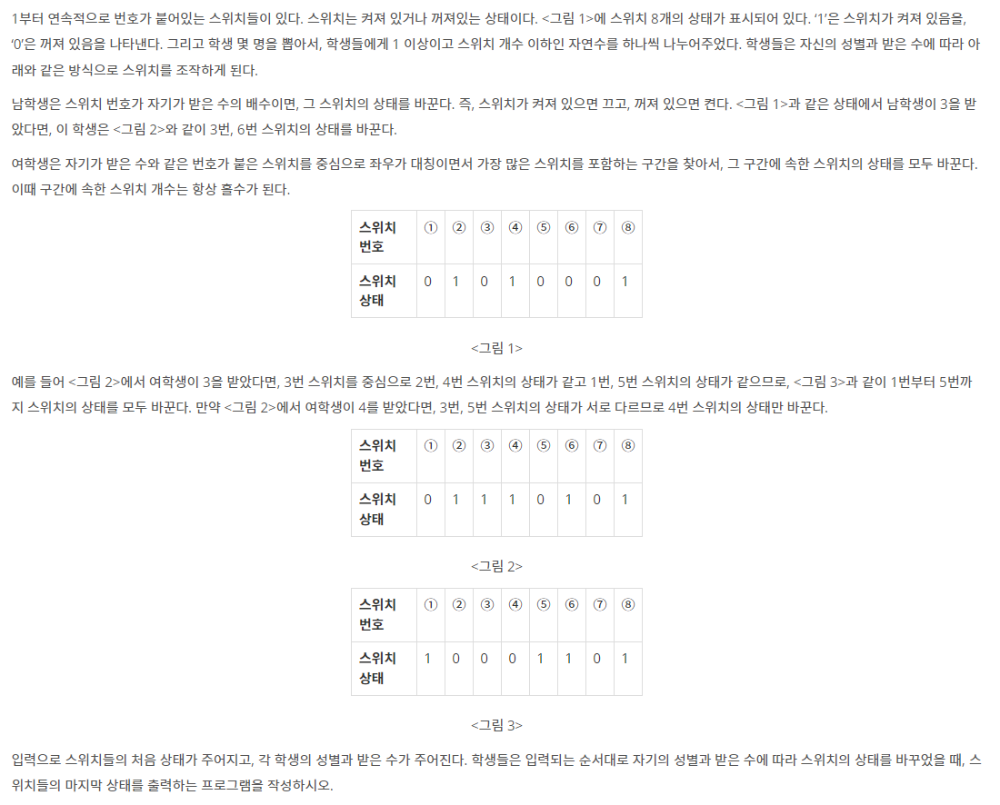
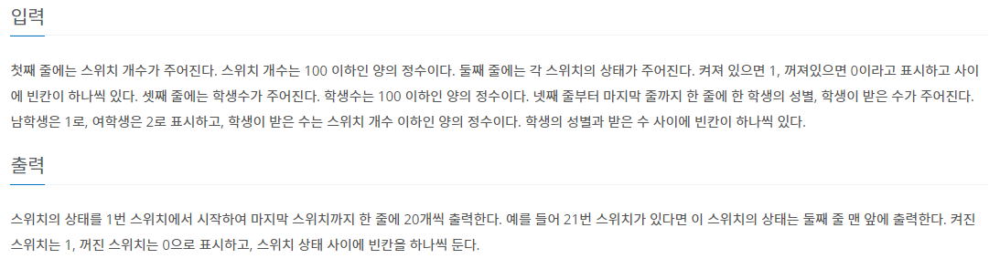

## [C / C++] 백준 1244번 - 스위치 켜고 끄기

#### 백준 1244번 - 스위치 켜고 끄기

**문제 링크** : <https://www.acmicpc.net/problem/1244>

## ✅ 문제 설명

먼저 스위치 개수 N을 입력하고, 스위치 N개의 상태를 입력한다. (상태  1 - 켜짐 / 0 - 꺼짐)

그 후 뽑을 학생의 수 M을 입력하고, 학생의 성별과 지정 숫자를 하나씩 입력한다. (1 - 남자 / 2 - 여자)

#### 🌈 남학생의 스위치 변경방법

지정 숫자의 배수가 되는 숫자의 스위치를 변경한다.

ex - 지정숫자 = 3  = > (3, 6, 9 ... < N)

N보다 작은 수 중에 **자신에게 배정된 숫자의 배수가 되는 모든 스위치**를 1은 0으로 0은 1로 바꾼다.

🔽 **변경 전**

| **1** | **2** | **3** | **4** | **5** | **6** | **7** | **8** | **9** |
| :---: | :---: | :---: | :---: | :---: | :---: | :---: | :---: | :---: |
|   1   |   0   |   0   |   0   |   0   |   0   |   0   |   0   |   1   |

🔽 **변경 후**

| **1** | **2** | **3** | **4** | **5** | **6** | **7** | **8** | **9** |
| :---: | :---: | :---: | :---: | :---: | :---: | :---: | :---: | :---: |
|   1   |   0   | **1** |   0   |   0   | **1** |   0   |   0   | **0** |

#### 🌈 여학생의 스위치 변경방법

지정 숫자를 기준으로 **좌우가 대칭이면서 가장 많은 스위치를 포함하는 구간**을 찾아 스위치를 변경한다.

ex - 지정숫자 = 6

5 VS 7 : 같다면? 

-> 4 VS 8 : 같다면? 

-> 3 VS 9 : 다르다면? 

=> 4 ~ 8 번에 해당되는 모든 스위치를 1은 0으로 0은 1로 변경

🔽 **변경 전**

| **1** | **2** | **3** | **4** | **5** | **6** | **7** | **8** | **9** |
| :---: | :---: | :---: | :---: | :---: | :---: | :---: | :---: | :---: |
|   0   |   0   |   1   |   0   |   1   |   1   |   1   |   0   |   0   |

🔽 **변경 후**

| **1** | **2** | **3** | **4** | **5** | **6** | **7** | **8** | **9** |
| :---: | :---: | :---: | :---: | :---: | :---: | :---: | :---: | :---: |
|   0   |   0   |   1   | **1** | **0** | **0** | **0** | **1** |   0   |

**만약 지정 숫자 양쪽부터 다르다면?**

🔽 **변경 전**

| **1** | **2** | **3** | **4** | **5** | **6** | **7** | **8** | **9** |
| :---: | :---: | :---: | :---: | :---: | :---: | :---: | :---: | :---: |
|   0   |   0   |   1   |   0   |   0   |   1   |   1   |   0   |   0   |

🔽 **변경 후**

| **1** | **2** | **3** | **4** | **5** | **6** | **7** | **8** | **9** |
| :---: | :---: | :---: | :---: | :---: | :---: | :---: | :---: | :---: |
|   0   |   0   |   1   |   0   |   0   | **0** |   1   |   0   |   0   |

지정 숫자의 스위치만 변경하고 끝!

## ✅ 알고리즘 설명

처음 이 문제를 보자마자 재귀로 구현해야 할 것 같다는 생각이 들었다. 그래서 가볍게(?) 재귀로 시작,,

먼저 스위치의 개수 N을 입력받는다. 그 후 문제에서 **스위치가 개수가 100개 이하라고 지정했고, 스위치의 번호를 0번이 아닌 1번부터 시작**하였기 때문에 헷갈리는 것을 방지하여 **101개의 배열을 생성하여 1번부터 입력**받도록 했다.

그 다음에는 학생 수를 입력받는다. 그 후 학생의 성별과 지정숫자를 차례로 입력받는다.

그 다음 학생의 성별과 지정숫자를 반복문을 통해 남자일 때와 여자일 때를 나눠 각각의 함수로 보내 계산한다.

#### 🌈 남학생의 경우 (알고리즘)

남학생은 단순하게 지정숫자의 배수만 구하면 되기 때문에

현재 인덱스가 **N보다 커지면 종료하는 조건으로 계속해서 재귀함수**를 통해 스위치의 상태를 바꿔주었다.

`void male(int *state, int num, int i) {
	if (i*num > n)` // 현재 인덱스가 n보다 크다면 종료
		`return;`
	`state[i * num] ^= 1;` // 스위치의 상태 변경
	`male(state, num, i + 1);`
`}`

**index = i * num** 을 사용했기 때문에 다음 함수에 i+1을 전해주면 index = 1 * num / 2 * num / 3 * num,,, 이런식으로 계속해서 num의 배수가 전달되게 된다.

#### 🌈 여학생의 경우 (알고리즘)

여학생은 지정 숫자를 기준으로 계속해서 양쪽을 비교해야 하기 때문에, **양쪽이 다른 경우 이전까지의 스위치(같았던 스위치)만 변경해주고 종료**하는 조건으로 재귀함수를 사용하였다.

`void female(int *state, int current, int i) {`
	`if (state[current - i] == state[current + i]) {` // 두 스위치가 같다면
		`if ((current > 1 && current < n) && (current + i <= n && current - i > 0)) {`// 현재 스위치가 첫번째랑 마지막 스위치가 아니라면
			`state[current - i] = state[current + i] = state[current + i] ^ 1;`
			`female(state, current, i + 1);`// +1 너머의 스위치 비교하기
		`}`
		`else state[current] ^= 1;`
	`}`
	`else {`
		`state[current] ^= 1;`
	`}`
`}`

i = 1부터 시작해서 지정 숫자를 기준으로 -1, +1번째의 스위치 비교

-> 같으면 재귀함수로 i+1을 보내 지정 숫자를 기준으로 -2, +2 번째 스위치 비교

-> **다를 때까지 재귀함수로 i+x를 보내 -x, +x번째 스위치를 비교하는 것을 반복함**

다른 순간 스위치의 상태를 바꾸고 종료

## ✅ 코드

