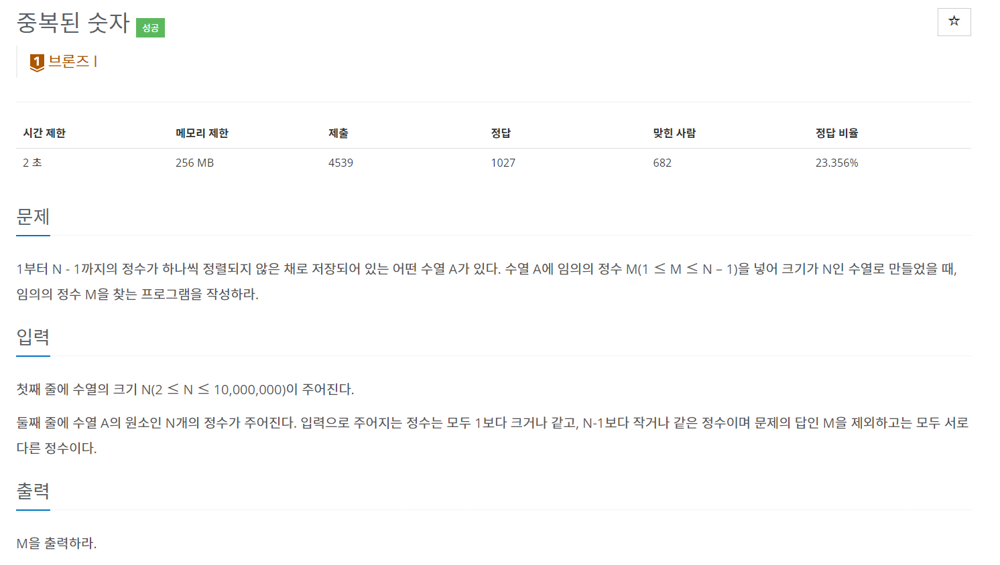
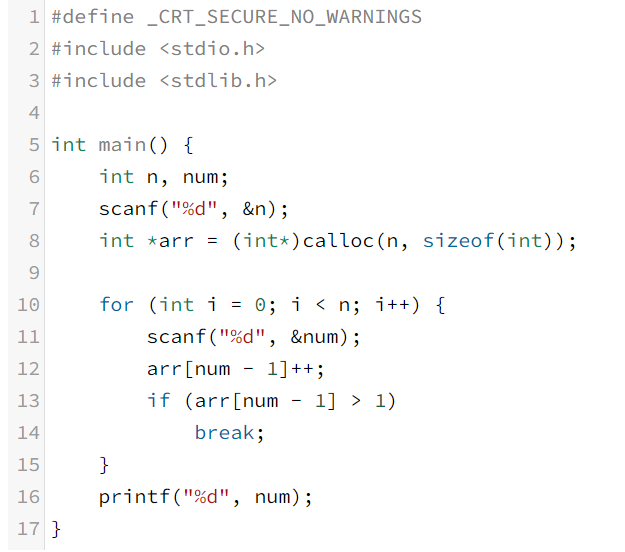

---

title:  "[C/C++] 백준 15719번 - 중복된 숫자"
excerpt: "백준 코드 리뷰"

categories:
  - 백준 코드 리뷰
tags:
  - [Blog, Github, Git, C++, C, 백준, Baekjoon, 백준15719, 백준_15719번, 15719번, c++_15719, 15719_c++]

toc: true
toc_sticky: true

date: 2022-01-27
last_modified_at: 2022-01-27

---

## [C / C++] 백준 15719번 - 중복된 숫자

#### 백준 15719번 - 중복된 숫자

**문제 링크** : <https://www.acmicpc.net/problem/15719>

## ✅ 문제 설명

먼저 숫자 N을 입력하고, N 개의 정수를 입력한다. 정수는 1 ~ N - 1 사이의 숫자로 이루어져 있는데, 1개의 숫자 M을 제외하고는 모두 다른 정수이다. 

여기서 **어떤 다른 정수와 겹친 숫자 M을 찾아내는 것**이 이 문제의 목표이다.

## ✅ 알고리즘 설명

처음 이 문제를 풀 때에는 숫자 N을 입력받은 후, N개의 배열을 만들어 수열을 입력할 때마다 해당 수열의 배열을 1씩 증가시키도로 풀었다. 

따라서 같은 숫자가 나왔을 때 해당 배열의 크기가 1이 넘게되면서 탈출하여 해당 숫자를 출력하는 방법이었다.

그러나, 해당 방법은 답은 맞게 나올 수 있으나 배열을 만들고 각 배열을 증가시킨다는 점에서 시간이 너무 오래걸려서 시간초과가 났다 ㅠㅠ

🔽 **시간 초과 난 버전**

그래서 이번엔 다른 방법으로 풀어보았다.

1. SUM 에는 입력한 수열의 합
2. SUM_2 에는 1~N-1까지의 숫자의 합

ex) 10, [1 2 2 5 6 4 3 7 8 9]

* SUM = 1 + 2 + 2 + 5 + 6 + 4 + 3 + 7 + 8 + 9 = 47
* SUM_2 = 1 + 2 + 3 + 4 + 5 + 6 + 7 + 8 + 9   = 45

이렇게 저장하면 **SUM에는 (SUM_2 + M)의 값이 저장**된다는 사실을 알 수 있다.

따라서 SUM - SUM_2 = M의 값이 나오게 된다.

## ✅ 코드

