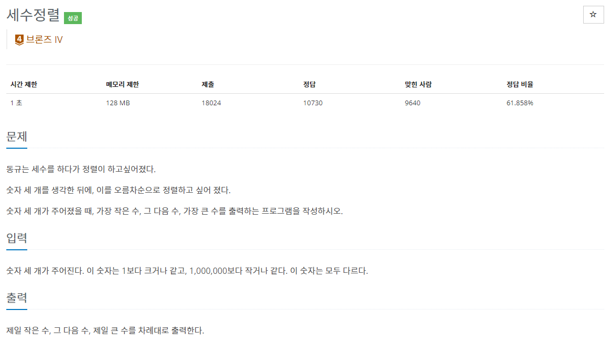

## [C / C++] 백준 2752번 - 세수정렬

**문제 링크** : <https://www.acmicpc.net/problem/2752>

## ✅ 문제 설명

총 3개의 숫자를 입력하면, 오름차순으로 출력하는 문제이다.

## ✅ 알고리즘 설명

사실 이 문제는 리뷰가 필요없는 쉬운 문제라서 할까말까 고민했다. 

그런데 이때는 C언어로 구현했고, 최근 C++을 공부하게 되면서 C++로 좀 더 쉽게 구현할 수 있을 것 같아서 리뷰하게 되었다.

------

총 3개의 방법을 구현했다.

먼저 3개의 숫자 a, b, c를 입력한다.

#### 🌈 알고리즘 - C (1)

a가 b와 c보다 크면 가장 큰 수는 a, 그 다음으로 b와 c를 비교하여 두번째와 세번째 숫자를 구했다.

이런 식으로 a, b, c 중 가장 큰 수를 기준으로 나머지 두 개를 비교하여 세 수를 각각 max, mid, min에 저장하였다.

#### 🌈 알고리즘 - C (2)

중첩 반복문을 통해 a~c를 차례로 비교하여 만약 a가 b보다 크다면 a와 b를 교체하여 b a c 순으로 만들고, a가 c보다 크다면 b c a 순으로 정렬하는 방법을 사용하였다.

이렇게 1~3번째 숫자까지 모두 이 방법을 사용하면 작은 수부터 차례로 정렬된 배열이 남게된다.

#### 🌈 알고리즘 - C++

C++의 내장함수 sort()를 사용하여 풀었다.

## ✅ 코드_C (1)

## ✅ 코드_C (2)

## ✅ 코드_C++

