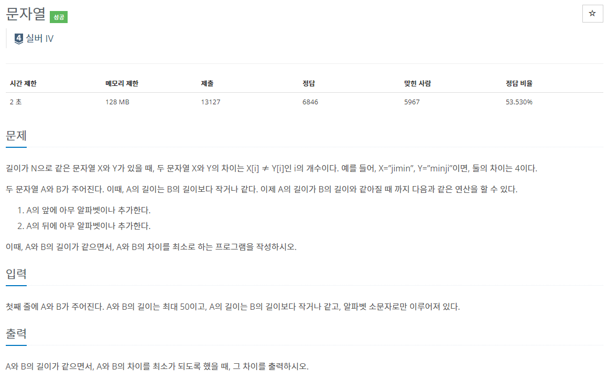

## [C / C++] 백준 1120번 - 문자열

#### 백준 1120번 - 문자열



**문제 링크** : <https://www.acmicpc.net/problem/1120>


## ✅ 문제 설명

길이가 같은 두 개의 문자열 X와 Y가 있다고 가정하자.

X = "minji" / Y = "jimin" 이라면 둘의 차이는 4이다.

|  X   |  O   |  X   |  X   |  X   |
| :--: | :--: | :--: | :--: | :--: |
|  m   |  i   |  n   |  j   |  i   |
|  j   |  i   |  m   |  i   |  n   |

2번째에 'i'가 같은 것을 제외하고는 모두 다르기 때문에 차이는 '4'인 것이다.

이 문제에서는 위와 다르게 서로 길이가 다른 두 개의 문자열 A, B가 주어진다. **A는 무조건 B의 길이보다 작거나 같고**, A의 길이와 B의 길이가 같아질 때까지 다음의 두 연산을 진행할 수 있다.

1. A의 앞에 아무 알파벳이나 추가한다.
2. A의 뒤에 아무 알파벳이나 추가한다.

이때 **두 문자열의 길이가 같으면서, 둘의 차이를 최소**로 하는 문자열 A를 출력하라.


## ✅ 알고리즘 설명

이 문제를 간단하게 설명하자면 A는 무조건 B의 길이보다 작거나 같기 때문에, **A와 B의 길이가 같을 때까지 한 칸씩 밀면서 비교하여 최소값을 도출**하면 된다.

예를 들어

##### 🌈 예제 1

| index |  0   |  1   |  2   |  3   |  4   |  5   |  6   |
| :---: | :--: | :--: | :--: | :--: | :--: | :--: | :--: |
|   A   |  a   |  d   |  a   |  a   |  b   |  c   |      |
|   B   |  a   |  a   |  b   |  a   |  b   |  b   |  c   |

**둘의 차이 = index[1, 2, 5] => 3개**


| index |  0   |  1   |  2   |  3   |  4   |  5   |  6   |
| :---: | :--: | :--: | :--: | :--: | :--: | :--: | :--: |
|   A   |      |  a   |  d   |  a   |  a   |  b   |  c   |
|   B   |  a   |  a   |  b   |  a   |  b   |  b   |  c   |

**둘의 차이 = index[2, 4] => 2개**

따라서 B[0]인 'a'를 추가한 'aadaabc' 가 가장 차이가 적은 문자열이 된다.


##### 🌈 예제 3

|  x   |  0   |  1   |  2   |  3   |  4   |  5   |  6   |  7   |
| :--: | :--: | :--: | :--: | :--: | :--: | :--: | :--: | :--: |
|  A   |  k   |  o   |  d   |  e   |  r   |      |      |      |
|  B   |  t   |  o   |  p   |  c   |  o   |  d   |  e   |  r   |

**둘의 차이 = 4개**


|  x   |  0   |  1   |  2   |  3   |  4   |  5   |  6   |  7   |
| :--: | :--: | :--: | :--: | :--: | :--: | :--: | :--: | :--: |
|  A   |      |  k   |  o   |  d   |  e   |  r   |      |      |
|  B   |  t   |  o   |  p   |  c   |  o   |  d   |  e   |  r   |

**둘의 차이 = 5개**


|  x   |  0   |  1   |  2   |  3   |  4   |  5   |  6   |  7   |
| :--: | :--: | :--: | :--: | :--: | :--: | :--: | :--: | :--: |
|  A   |      |      |  k   |  o   |  d   |  e   |  r   |      |
|  B   |  t   |  o   |  p   |  c   |  o   |  d   |  e   |  r   |

**둘의 차이 = 5개**


|  x   |  0   |  1   |  2   |  3   |  4   |  5   |  6   |  7   |
| :--: | :--: | :--: | :--: | :--: | :--: | :--: | :--: | :--: |
|  A   |      |      |      |  k   |  o   |  d   |  e   |  r   |
|  B   |  t   |  o   |  p   |  c   |  o   |  d   |  e   |  r   |

**둘의 차이 = 1개**


따라서 B[0], B[1], B[2]를 추가한 'topkoder'라 가장 차이가 적은 문자열이 된다.


## ✅ 코드

```c++
#define _CRT_SECURE_NO_WARNINGS
#include <iostream>
#include <cstring>
#include <climits>
using namespace std;
const int INF = 987654321; // 먼저 최대 정수값을 저장함

int main() {
	char A[51], B[51];
	scanf("%s%s", A, B);

	int cnt = 0, before = INF;
    /* A를 한칸씩 밀어서 길이가 같을 때까지 반복 */
	for (int i = 0; i < strlen(B) - strlen(A) + 1; i++) {
		cnt = 0;
		for (int j = 0; j < strlen(A); j++) {
			if (A[j] != B[j + i]) // 둘이 다르면 cnt++
				cnt++;
		}
        /* 이전에 구했던 cnt랑 비교해서 최소값을 저장 */
		before = (before < cnt) ? before : cnt;
	}

	printf("%d\n", before);
	return 0;
}
```
