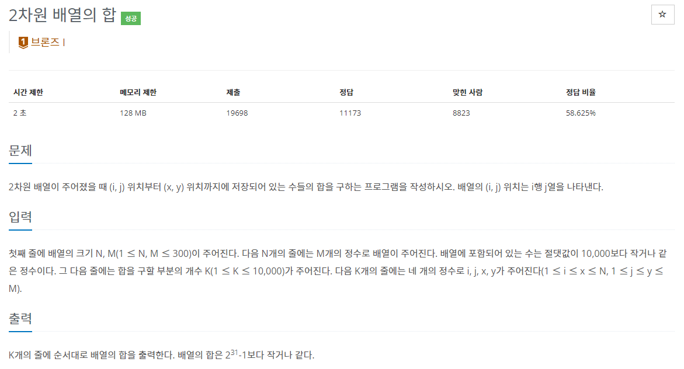

## [C / C++] 백준 2167번 - 2차원 배열의 합

#### 백준 2167번 - 2차원 배열의 합




**문제 링크** : <https://www.acmicpc.net/problem/2167>


## ✅ 문제 설명

##### ✔ 입력 방법

1. 첫째 줄에 배열의 크기 N, M을 입력한다.
2. N + 1번째 줄까지  N X M 크기의 배열을 입력한다.
3. 그 다음 줄에 합을 구할 구간의 개수 K를 입력한다.
4. K줄에 걸쳐 구간 (i, j), (x, y) 입력

이렇게 입력한 정보를 이용하여 **N X M의 배열에서 좌표 (i, j) ~ (x, y) 구간의 합**을 구하여 차례로 출력하는 문제이다.


## ✅ 알고리즘 설명

문제 설명 속의 방법으로 모두 입력을 받았다면, (i, j) ~ (x, y) 구간의 합을 구하면 된다.

인덱스는 0부터 시작하기 때문에 

**row = (i - 1) / col = (j - 1) 부터 시작하여 (x, y) 좌표가 될 때까지의 합을 누적**하면 된다.

```c++
int i, j, x, y; 
scanf("%d%d%d%d", &i, &j, &x, &y);
for (int row = i - 1; row < x; row++) { // row
	for (int col = j - 1; col < y; col++) // col
		sum[a] += arr[row][col]; // 구간 사이의 합 누적
}		
```

이렇게 구해진 값을 sum[] 배열에 저장하여, 모든 반복문이 끝나면 차례로 출력해주면 된다.


## ✅ 코드

```c++
#define _CRT_SECURE_NO_WARNINGS
#include <iostream>
using namespace std;

int main() {
	int n, m; // 배열의 크기
	scanf("%d%d", &n, &m);

	/* 배열 입력 */
	int arr[300][300] = { 0 };
	for (int a = 0; a < n; a++) {
		for (int b = 0; b < m; b++) {
			scanf("%d", &arr[a][b]);
		}
	}

	int k; // 몇 개의 구간 탐색할 것인지 입력
	scanf("%d", &k);
	
	
	int sum[10000] = { 0 };
	for (int a = 0; a < k; a++) {
		/* (i,j) ~ (x,y) 구간 탐색 */
		int i, j, x, y; 
		scanf("%d%d%d%d", &i, &j, &x, &y);
		for (int q = i - 1; q < x; q++) { // row
			for (int b = j - 1; b < y; b++) // col
				sum[a] += arr[q][b]; // 구간 사이의 합 누적
		}
	}

	for (int a = 0; a < k; a++) {
		printf("%d\n", sum[a]);
	}
}
```
