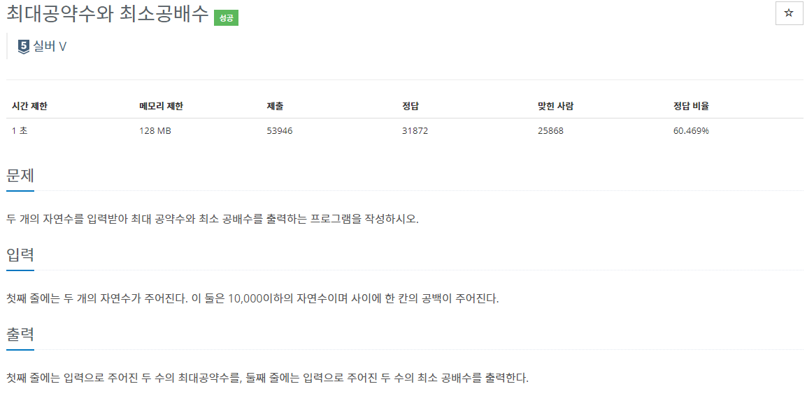

## [C / C++] 백준 2609번 - 최대공약수와 최대공배수

#### 백준 2609번 - 최대공약수와 최대공배수

**문제 링크** : <https://www.acmicpc.net/problem/2609>

## ✅ 문제 설명

두 개의 자연수를 입력받아, 첫째 줄에는 최대 공약수를, 둘째 줄에는 최소 공배수를 출력하는 문제이다.

## ✅ 알고리즘 설명

이번 문제는 최대 공약수 (GCD)와 최소 공배수(LCM)을 구하는 문제이다.

**▶ GCD (최대공약수) : Greatest Common Divisor**

**▶ LCM (최소공배수) : Least Common Multiple**

## ✅ 코드

