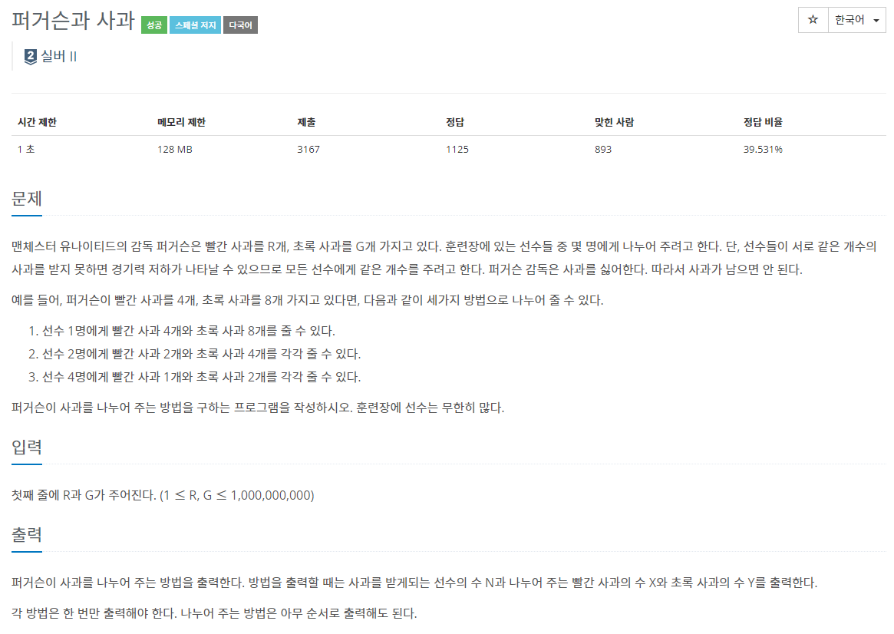

## [C / C++] 백준 2942번 - 퍼거슨과 사과

#### 백준 2942번 - 퍼거슨과 사과




**문제 링크** : <https://www.acmicpc.net/problem/2942>


## ✅ 문제 설명

맨유의 감독 퍼거슨은 빨간 사과를 R개, 초록 사과를 G개 갖고 있다. 훈련장에 있는 선수들 중 몇 명에게 나누어 주려고하는데 **반드시 같은 개수의 사과를 나누어 주어야 한다.** 또한, **사과가 남아서도 안된다.**

> **사과를 남기지 않고, 똑같은 개수로 사과를 나눠줄 수 있는 경우의  수를 모두 찾아내어야 한다.**

각 방법은 한 번씩만 출력하되, 방법의 순서는 상관 없다.

사과를 받는 선수의 수 N / 빨간 사과의 수 X / 초록 사과의 수 Y를 차례로 출력해라.


## ✅ 알고리즘 설명

###### ✔ 예제 1

R = 4, G = 8

| **선수의 수 N** | **빨간 사과의 수 X** | **초록 사과의 수 Y** |
| :-------------: | :------------------: | :------------------: |
|      **1**      |        **4**         |        **8**         |
|      **2**      |        **2**         |        **4**         |
|      **4**      |        **1**         |        **2**         |

이 문제의 예제를 보면 한 가지 규칙성을 찾을 수 있다.

바로 **N이 R과 G의 공약수**라는 것이다. 

즉 **N은 R과 G의 공약수이고 [ X == R / N, Y == G / N ]** 이라는 것이다.

따라서 R, G의 공약수를 구하고, 이를 R과 G에 차례로 나눠 출력하면 되는 것이다.

모든 숫자를 비교하기 보다는 시간초과를 방지하기 위해, 

**최대 공약수를 구한 후 그것을 이용해서 문제를 풀었다. (공약수는 어차피 최대공약수의 약수이기 때문에)** 


## ✅ 코드

```c++
#define _CRT_SECURE_NO_WARNINGS
#include <iostream>
#include <cmath>
using namespace std;

int gcd(int b, int s) {
	return ((b % s == 0) ? s : gcd(s, b % s));
}
int main() {
	int r, g;
	scanf("%d%d", &r, &g);
	int num = (r > g) ? gcd(r, g) : gcd(g, r);
	for (int i = 1; i <= num; i++) {
		if (num % i == 0)
			printf("%d %d %d\n",i, r / i, g / i);
	}
	return 0;
}
```
