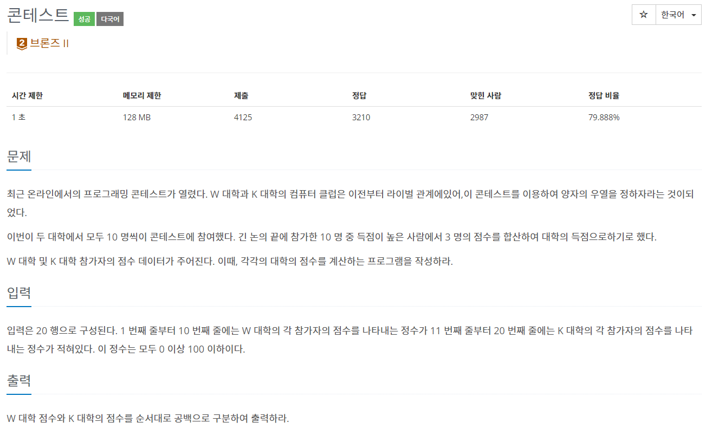

## [C / C++] 백준 5576번 - 콘테스트

#### 백준 5576번 - 콘테스트




**문제 링크** : <https://www.acmicpc.net/problem/5576>


## ✅ 문제 설명

이 문제는 각 대학의 상위 3명의 점수 총합을 출력하는 문제이다.

1~10번째 줄까지 W대학 참가자의 점수를, 11~20번째 줄까지 K대학 참가자의 점수를 차례로 입력한 후 각 대학의 상위 3명의 점수의 총합을 구하여 출력하면 된다.

1~10번째 줄 : W대학 참가자의 점수 입력

11~20번째 줄 : K대학 참가자의 점수 입력

21번째 줄 : 각 대학의 상위 3명의 점수 총합 출력


## ✅ 알고리즘 설명

배열 W와 K를 만들어 각 대학의 개개인의 점수를 저장하였고, 그 후 sort() 함수를 통해 정렬하였다. 

정렬이 되었다면 7~9번째 배열의 점수가 상위 3명의 점수이므로 각 대학의 상위 3명의 점수를 합산하여 출력하였다.


## ✅ 코드

```c++
#define _CRT_SECURE_NO_WARNINGS
#include <iostream>
#include <algorithm>
using namespace std;

int main(void) {
    int W[10], K[10];
    for (int i = 0; i < 10; i++)
        scanf("%d", &W[i]);
    sort(W, W + 10);
    for (int i = 0; i < 10; i++)
        scanf("%d", &K[i]);
    sort(K, K + 10);
    int sum_w = 0, sum_k = 0;
    for (int i = 7; i < 10; i++) // 상위 3명의 점수
        sum_w += W[i], sum_k += K[i];
    printf("%d %d\n", sum_w, sum_k);
    return 0;
}
```

<https://github.com/2hyunjinn/Baekjoon/blob/4081d5cb1ecea1b7e9186419bbbecf8f2b909cb4/Baekjoon_5576.cpp>

