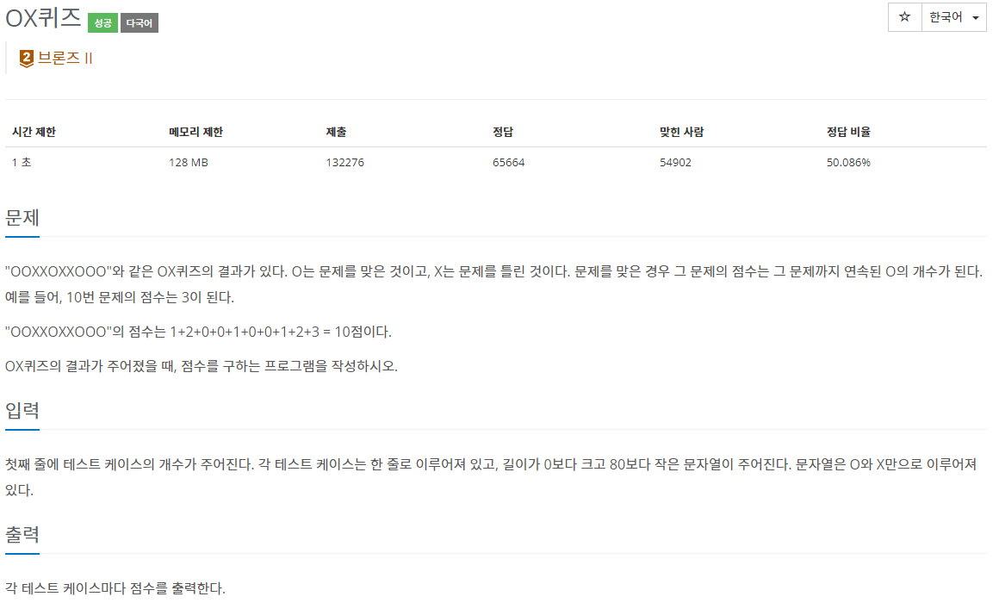

## [C / C++] 백준 8958번 - OX퀴즈

#### 백준 8958번 - OX퀴즈



문제 링크** : <https://www.acmicpc.net/problem/8958>


## ✅ 문제 설명

OX퀴즈의 결과를 문자열로 입력하면 연속된 O의 개수만큼 점수를 더하여 총점을 알아내는 문제이다.

'OOXXOXXOOO' 의 경우, 

|  O   |  O   |  X   |  X   |  O   |  X   |  X   |  O   |  O   |  O   |
| :--: | :--: | :--: | :--: | :--: | :--: | :--: | :--: | :--: | :--: |
|  1   |  2   |  0   |  0   |  1   |  0   |  0   |  1   |  2   |  3   |

1 + 2 + 0 + 0 + 1 + 0 + 0 + 1 + 2 + 3 = 10점이 나오게 된다.

**점수는 연속된 O의 개수만큼 1점씩 늘어나게 된다.**


## ✅ 알고리즘 설명

문자열 한 줄에서 'X'가 나오면 점수를 초기화해야 하기 때문에,  **'X'일 경우는 cnt를 0으로 초기화**하였고, 

'O'일 경우 ++cnt 한 값을 sum에 더해주었다. 

그렇게 문자열 한 줄이 끝나면 누적된 sum의 값을 출력하였다.


## ✅ 코드

```c++
#define _CRT_SECURE_NO_WARNINGS
#include <iostream>
#include <cstring>
using namespace std;

int main()
{
	int n;
	scanf("%d", &n);
	char word[80];
	
	while (n--) {
		scanf("%s", word);
		getchar();
		int cnt = 0, sum = 0;
		for (int i = 0; i < strlen(word); i++) {
			if (word[i] == 'X') {
				cnt = 0;
				continue;
			}
			sum += ++cnt;
		}
		printf("%d\n", sum);
	}
	return 0;
}
```
