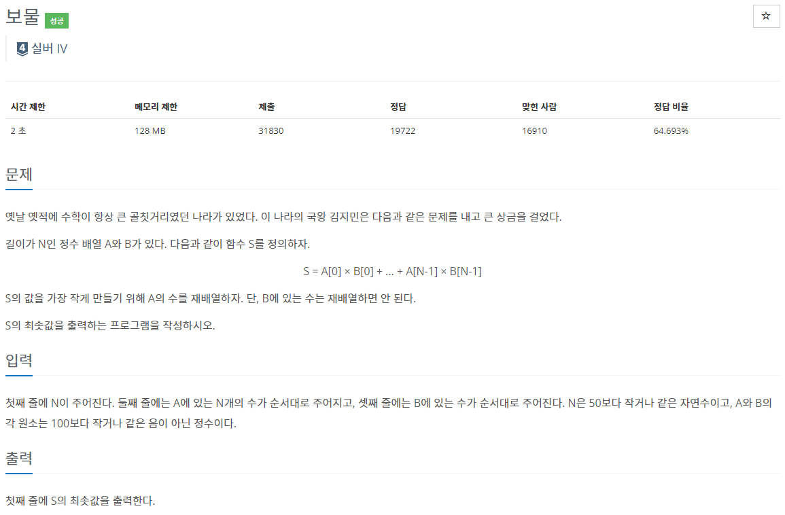

## [C / C++] 백준 1026번 - 보물

#### 백준 1026번 - 보물



**문제 링크** : <https://www.acmicpc.net/problem/1026>


## ✅ 문제 설명

첫째 줄에는 배열의 크기 N을 입력한다. 둘째 줄에는 배열 A의 값 N개를 입력하고, 셋째 줄에는 배열 B의 값 N개를 입력한다.

그 후 A를 재배열하여 **S의 최솟값을 출력**하면 된다. S는 다음과 같이 정의할 수 있다.

> **S = A[0] X B[0] + ... + A[N-1] X B[N-1]**

**여기서 A 배열은 재배열 할 수 있으며, B 배열은 재배열하면 안된다.**


## ✅ 알고리즘 설명

처음에는 B는 재배열 할 수 없다고 되어있어서 B의 순서를 따로 저장해서 A를 정렬하여 곱해주려고 했는데, 정답에는 큰 지장이 없어서 그냥 둘 다 정렬하는 방법을 사용했다.

이 문제를 잘 들여다보면 최솟값을 구하기 위해서는 가장 큰 값 * 가장 작은 값을 곱하면 된다는 것을 알 수 있다.


예를 들어,

##### ▶ 예제 1

A = [ 1, 1, 1, 6, 0 ]

B = [ 2, 7, 8, 3, 1 ]

각 배열에서 가장 큰 수와 작은 수인 0, 1, 6, 8을 계산할 때,

 6 X 8 + 0 X 1 보다는 8 X 0 + 6 X 1이 훨씬 숫자가 작다.

따라서 **A를 오름차순으로 B를 내림차순으로 정렬하여 순서대로 곱해주면 S의 최솟값**을 구할 수 있다.


## ✅ 코드

```c++
#define _CRT_SECURE_NO_WARNINGS
#include <iostream>
#include <algorithm>
using namespace std;

int n;
int A[50], B[50];

/* 내림차순 정렬 */
bool compare(int x, int y) {
	return (x > y);
}

/* 배열 입력 */
void input_info() {
	scanf("%d\n", &n);
	for (int i = 0; i < n; i++)
		scanf("%d", &A[i]);
	for (int i = 0; i < n; i++)
		scanf("%d", &B[i]);
}

/* 배열 정렬 */
void sort_arr() {
	sort(A, A + n); // 오름차순
	sort(B, B + n, compare); // 내림차순
}

/* S의 최솟값 구하기 */
int get_S() {
	int sum = 0;
	for (int i = 0; i < n; i++)
		sum += (A[i] * B[i]);
	return sum;
}

int main() {
	input_info();
	sort_arr();
	printf("%d\n", get_S());
	return 0;
}
```

<https://github.com/2hyunjinn/Baekjoon/blob/ac25a30f27584d329eff36d5f0c56ff76608207e/Baekjoon_1026.cpp>
