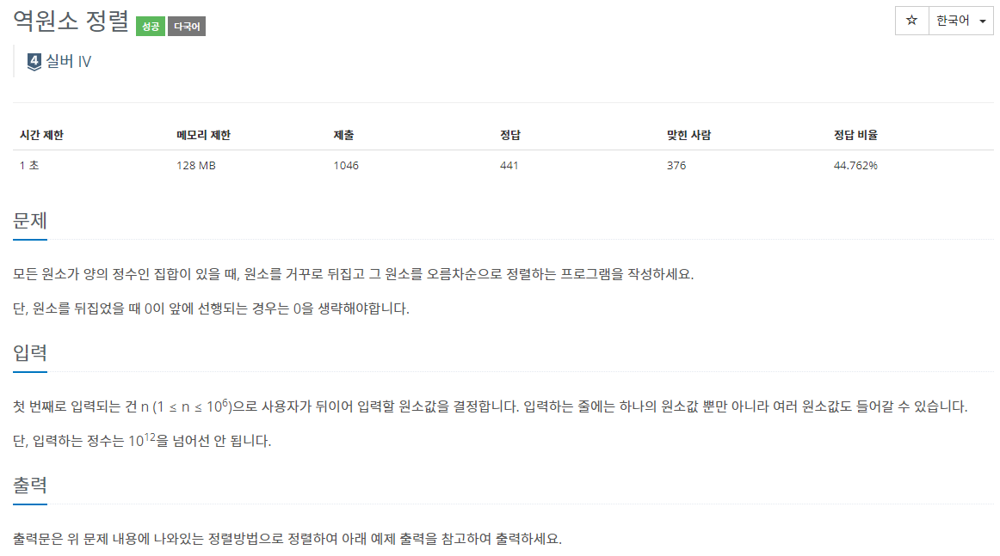

## [C / C++] 백준 5648번 - 역원소 정렬

#### 백준 5648번 - 역원소 정렬



**문제 링크** : <https://www.acmicpc.net/problem/5648>


## ✅ 문제 설명

첫 번째로 원소의 개수 N을 입력한다. 그 후 N개의 원소 값을 입력하되, 줄은 상관하지 않고, 한 줄에 여러개 혹은 여러 줄에 한개씩 입력해도 된다.

그렇게 **입력한 원소의 값을 거꾸로 뒤집은 후 작은 수부터 차례로 출력**하면 된다.

예를 들어, 90010을 입력하면 01009로 뒤집으면 된다.

이때, **0이 앞에 나오는 경우 0을 생략**하여 1009로 출력하면 된다.


## ✅ 알고리즘 설명

문자열과 숫자를 이용하여, 총 2가지 방법으로 이 문제를 풀었다.


#### ▶ 문자열 reverse()

먼저, 문자열 string을 통해 숫자를 입력한다. 그 후 입력받은 문자열을 reverse_arr() 함수로 보내 거꾸로 뒤집어 vector에 추가한다.


**이때 reverse_arr() 함수를 살펴보면**

##### 👀 string reverse_arr(string input)

```c++
/* 문자열 뒤집기 */
string reverse_arr(string input) {
	if (input.length() == 1) return input; // 일의 자리 수라면
	
	reverse(input.begin(), input.end()); // 뒤집기
	for (int i = 0; i < input.length(); i++) {
		if (input[i] != '0') return input.substr(i);
	}
}
```


문자열의 길이가 1이라면 **일의 자리 수이므로 뒤집을 필요없이 반환**한다.

```c++
if (input.length() == 1) return input; // 일의 자리 수라면
```


**일의 자리수가 아니라면** 

1. 먼저 문자열을 뒤집는다.
2. 0이 나오지 않을 때까지 i++을 하다 0이 나오지 않는 순간 **substr()을 통해 앞에 0을 다 없앤 새로운 문자열을 반환**한다.
   * **ex) "00901".substr(2) -> "901"**

```c++
reverse(input.begin(), input.end()); // 뒤집기
for (int i = 0; i < input.length(); i++) {
	if (input[i] != '0') return input.substr(i); // 새로운 문자열 반환
}
```


그 후 vector를 정렬하는데, 이때 길이를 먼저 판단하고 길이가 같다면 사전순으로 정렬한다.

##### 👀 compare(string a, string b)

```c++
bool compare(string a, string b) {
	if (a.length() == b.length()) return a < b; // 길이가 같으면 사전 순
	return a.length() < b.length(); // 길이 짧은 순
}
```

-----

#### ▶ 숫자

먼저, 숫자를 입력하고, 그 숫자를 reverse_num()으로 보내 뒤집은 후 vector에 넣어준다.


**이때 reverse_num() 함수를 살펴보면**

##### 👀 ll reverse_arr(ll input)

```c++
/* 숫자 뒤집기 */
ll reverse_num(ll input) {
	if (input < 10) return input; // 일의 자리 수라면
	
	ll sum = input % 10;
	while (1) {
		input /= 10;
		sum = (sum * 10) + (input % 10);
		if (input % 10 == input) return sum;
	}
}
```


먼저 숫자가 10보다 작다면, **일의 자리 수이기 때문에 뒤집지 않고 반환**한다.

```c++
if (input < 10) return input; // 일의 자리 수라면
```


일의 자리 숫자가 아니라면, 숫자를 뒤집어 준다.

input % 10 == input(일의 자리가 되었다는 뜻) 이 될 때까지 반복문을 계속한다.

**ex) input = 10091**

**[ sum = (10091 % 10) ] = 1**


**[ input /= 10 ] = 1009**

**[ sum = (sum * 10) + (input % 10)] = 1 * 10 + 1009 % 10 = 19**


이렇게 계속 반복하다보면 19001이 되고, 이때 input % 10 == input이 되므로 sum을 반환하면 된다.

```c++
ll sum = input % 10;
while (1) {
	input /= 10;
	sum = (sum * 10) + (input % 10);
	if (input % 10 == input) return sum;
}
```


그 후 숫자를 정렬하여 출력하면 된다.


----

## ✅ 코드 (문자열)

```c++
#define _CRT_SECURE_NO_WARNINGS
#include <iostream>
#include <string>
#include <algorithm>
#include <vector>
using namespace std;

int n;
vector<string> v;

/* 길이 순, 사전 순 정렬 */
bool compare(string a, string b) {
	if (a.length() == b.length()) return a < b;
	return a.length() < b.length();
}

/* 문자열 뒤집기 */
string reverse_arr(string input) {
	if (input.length() == 1) return input; // 일의 자리 수라면
	
	reverse(input.begin(), input.end()); // 뒤집기
	for (int i = 0; i < input.length(); i++) {
		if (input[i] != '0') return input.substr(i);
	}
}

/* 문자열 입력 */
void input_info() {
	scanf("%d", &n);
	for (int i = 0; i < n; i++) {
		string input;
		cin >> input;
		v.push_back(reverse_arr(input));
	}
}

/* 문자열 출력 */
void print_info() {
	for (int i = 0; i < n; i++)
		cout << v[i] << "\n";
}

int main() {
	input_info();
	sort(v.begin(), v.end(), compare);
	print_info();
	return 0;
}
```

<https://github.com/2hyunjinn/Baekjoon/blob/c150f3f98e447646730b144ab9c72c6bca6ca9db/Baekjoon_5648(1).cpp>


## ✅ 코드 (숫자)

```c++
#define _CRT_SECURE_NO_WARNINGS
#include <iostream>
#include <algorithm>
#include <vector>
using namespace std;

typedef long long ll;
int n;
vector<ll> v;

/* 숫자 뒤집기 */
ll reverse_num(ll input) {
	if (input < 10) return input; // 일의 자리 수라면
	
	ll sum = input % 10;
	while (1) {
		input /= 10;
		sum = (sum * 10) + (input % 10);
		if (input % 10 == input) return sum;
	}
}

/* 숫자 입력 */
void input_info() {
	scanf("%d", &n);
	for (int i = 0; i < n; i++) {
		ll input;
		scanf("%lld", &input);
		v.push_back(reverse_num(input));
	}
}

/* 숫자 출력 */
void print_info() {
	for (int i = 0; i < n; i++)
		printf("%lld\n", v[i]);
}

int main() {
	input_info();
	sort(v.begin(), v.end());
	print_info();

	return 0;
}
```

<https://github.com/2hyunjinn/Baekjoon/blob/a3976fa1dacaa6475229817abfce4d066d153804/Baekjoon_5648(2).cpp>
