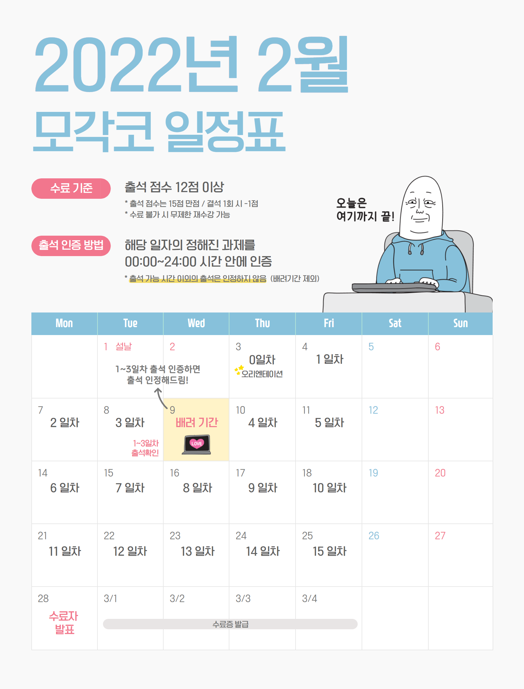

## 🌈 모각코 < Kotlin 기초편 >을 시작하며

#### ⚡ "모각코 2월" - <코틀린 기초편> 이란?

이번 방학 때 앱을 개발해보고 싶었는데, 

아무래도 아무 경험이 없이 혼자 시작하는 것이 부담스러워 

**'찍먹'💥** 이라도 해보자는 마음으로 가볍게 신청한 대외활동!!

코딩 커뮤니티를 줄여 **'코뮤니티'**라는 이름을 가진 

<u>코딩공부 카페의 대외활동</u> **'모각코**'에 참여했습니다 :-D

------

#### ⚡ 2월 모각코 일정표

2월 달은 주말을 제외하고 **2/3 ~ 2/25일 동안** 

**총 15일간 매일 진행**되는 활동으로,

이렇게 하루에 정해진 '학습내용'을 공부한 후, 

과제를 하여 출석인증을 하면 되는 활동입니다!

----

#### ⚡ 과제 제출은?

과제 제출은 codemate라는 사이트를 활용하여 제출합니다.

[codemate](https://codemate.kr/@guswlsdl04) **◀ 여기를 클릭해보세요!**

매일 한 과제씩 00:00 ~ 23:59 사이에 제출한 후 카페에 댓글을 달면 인증되는 시스템!

-----

코드메이트 뿐만 아니라 깃허브 블로그에도 같이 게시할 예정이니 둘 다 많이 들려주세요 B-)
