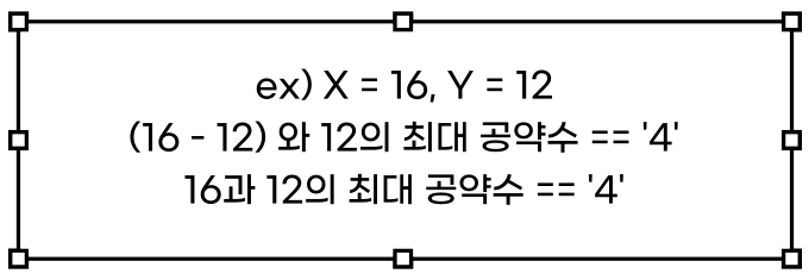

---

title:  "[알고리즘] GCD 최대공약수(유클리드 알고리즘) + LCM"
excerpt: "[알고리즘] GCD 최대공약수(유클리드 알고리즘) + LCM"

categories:
  - Algorithm
tags:
  - [Algorithm, 알고리즘, gcd, 최대공약수, 유클리드, gcd_c++, gcd알고리즘, lcm, 최소공배수]

toc: true
toc_sticky: true

date: 2022-02-07
last_modified_at: 2022-02-07
---

## [알고리즘] GCD 최대공약수 (유클리드 알고리즘) + LCM

### ✅ GCD란?

> **GCD(Greatest Common Divisor) : 최대공약수**

- 공약수란 ? 두 수 이상의 수의 공통된 약수
- 최대 공약수란? 공약수 중 가장 큰 수!


---

### ✅ 유클리드 호제법

#### 👀 인류 최초의 알고리즘?

GCD(최대공약수) 계산 알고리즘인, 

**'유클리드 호제법'**은 인류 최초의 알고리즘! (기원전 300년 경에 만들어짐)


#### 👀 유클리드 호제법이란?

**최대공약수를 구하는 알고리즘!**

> **"자연수 2개의 최대공약수 = (큰 수 - 작은 수)와 작은 수의 최대공약수"**



여기서 **뺄셈 대신 나눗셈을 이용**하여 좀 더 빠르게 구현한 것이

오늘 날 많이 쓰이는 유클리드 알고리즘!


----

### ✅ 알고리즘 구현 (재귀 함수)

```c++
int gcd(int big, int small){
	if(small == 0) return big;
	return gcd(small, big%small);
}
```

(큰 수) % (작은 수) == 0 이 될 때까지 함수를 계속 불러냄!

0이 되면 큰 수 반환


----

### ✅ 알고리즘 구현 (반복문)

```c++
int gcd(int big, int small){
	while(small!=0){
		int r = big % small;
		big = small;
		small = r;
	}
	return big;
}
```


---

### ✅ LCM (최소공배수)

> **LCM(Least Common Multiple) : 최소공배수**

두 수 A, B가 있다면,

**LCM = (A / GCD) X (B / GCD) X GCD**

```c++
int lcm(int a, int b, int gcd){
	return (a / gcd) * (b / gcd) * gcd;
}
```


-----


[instagram](https://www.instagram.com/p/CZTjVqdvTZT/?utm_source=ig_web_copy_link) ◀ CLICK HERE!


